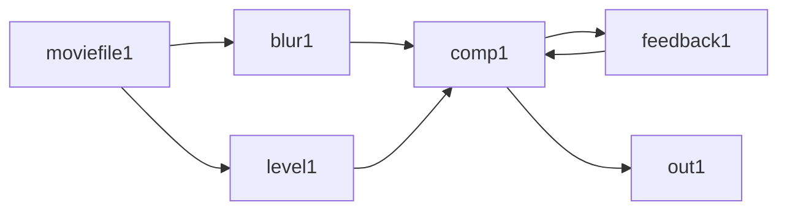
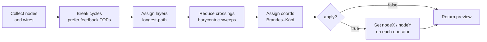

# Integration Guide

Get Touch from zero to "Claude is driving my TD project" in about ten minutes.

This guide assumes you have **TouchDesigner 2025 or newer**, **Node.js 20+**, and **Claude Code** installed. On Windows, paths use `%APPDATA%`; on macOS/Linux, substitute `~/.config`.

---

## 1. Get the repo

```bash
git clone https://github.com/zauster90/Touch.git
cd Touch
npm install
```

You don't need to build anything — `dist/index.js` is committed so the plugin installs without a build step.

## 2. Install the Claude Code plugin

In a Claude Code session, run:

```
/plugin install <absolute path to your clone of Touch>
```

Examples:
- Windows: `/plugin install C:/Users/you/Touch`
- macOS:   `/plugin install /Users/you/Touch`

Claude Code reads `.claude-plugin/plugin.json` and `.mcp.json` and registers the `touch` MCP server. You should now see nine `td_*` tools available to Claude.

## 3. Get the `.tox`

The `.tox` is the TouchDesigner-side component that hosts the HTTP server Claude talks to.

### 3a. If `toe/TouchAPI.tox` exists in the repo

Skip to step 4. You already have it.

### 3b. If it doesn't (early adopters)

Build it once by following [`toe/BUILD_TOX.md`](toe/BUILD_TOX.md). That guide walks you through creating a `TouchAPI` Container COMP with three DATs — the source DAT pastes in from [`toe/src/td_api.py`](toe/src/td_api.py), a tiny runtime shim DAT, and a bootstrap Execute DAT — plus three custom parameters (`Port`, `Status`, `Rotate`). Save the result to `toe/TouchAPI.tox` and commit.

The build is manual because `.tox` files are binary TD components — only the TD UI can produce them. You only do this once per TD version.

## 4. Load the component into TouchDesigner

1. Open TouchDesigner. Open your project (or a fresh one).
2. Drag `toe/TouchAPI.tox` from the file explorer into the `/project1` network. A `TouchAPI` node appears.
3. Select the `TouchAPI` node. On its parameter panel, find the **Settings** page.

On first load, TD generates a fresh random token and writes it to:

- **Windows:** `%APPDATA%\claude-td\token`
- **macOS/Linux:** `~/.config/claude-td/token` (mode `0600`)

The MCP server reads that same file on startup.

## 5. Verify the bridge is live

### 5a. From TD

Look at the `Status` custom parameter on `TouchAPI`. It should read:

```
READY @ 127.0.0.1:44444
```

If it reads `stopped`, open TD's textport (`Alt+T`) and look for Python tracebacks — most likely the `td_runtime_shim` DAT didn't run. See troubleshooting in `toe/BUILD_TOX.md`.

### 5b. From a terminal

```bash
curl -i http://127.0.0.1:44444/pane
```

You should get a `401 Unauthorized`. That's correct — it proves the server is bound and the auth gate works.

### 5c. End-to-end smoke

With TD running and the `.tox` loaded:

```bash
npm run smoke
```

This exercises seven of the nine tools against your live TD. If all return JSON, you're done.

For a deeper check, run the manual protocol in [`tests/manual.md`](tests/manual.md) — it covers token auth, Host-header rejection, and token rotation.

## 6. Talk to Claude

Start a Claude Code session anywhere. Try:

- "What TD network am I looking at?"
- "List the TOPs under `/project1`."
- "Add a noise TOP and wire it into the render."
- "Screenshot `out1`."
- "What errors are in the project?"

Claude invokes the appropriate `td_*` tool; the TS wrapper sends an HTTP request to `127.0.0.1:44444` with the bearer token; TD executes the action and returns a result.

## 7. Auto-layout: tidy your network

> **Status:** v0.2 — in design. This section documents the planned `td_layout` tool.

Ask Claude to organize any TD subnet into a clean left-to-right signal-flow layout. No dragging nodes by hand.

### What it does

`td_layout` reads a subnet (or a selection within one), computes a tidy position for every node using a full **Sugiyama** algorithm — cycle break, layer assignment, crossing minimization, balanced coordinate placement — and either shows you the plan (default) or applies it.

Given a typical signal-flow graph with a feedback loop:



`td_layout` places each node so the network reads left-to-right, layer by layer, with wires crossing as few times as possible:

```
   rank 0           rank 1          rank 2          rank 3

  [moviefile1] ──┬──▶ [blur1]  ──┐
                 │                ├──▶ [comp1] ───▶ [out1]
                 └──▶ [level1] ──┘     ▲   │
                                       │   ▼
                                  [feedback1]   ◀── back-edge
```

Horizontal rank = dataflow depth. Within each rank, siblings stack vertically and are ordered to minimize crossings. Cycles are broken at the most natural seam — preferring `feedbackTOP` operators, since that's where a human would break them — and preserved in the result as visible back-edges.

### Invoke it

Just ask Claude:

- "Tidy `/project1/comp1`."
- "Organize the selected nodes in this pane."
- "Lay out the current network top-to-bottom and apply it."
- "Show me the layout plan for comp1 before we move anything."

### Tool signature

```ts
td_layout({
  path?: string,              // target COMP; defaults to current pane
  selection_only?: boolean,   // only lay out selected children within `path`
  direction?: "LR" | "TB",    // default "LR" (signal flow left-to-right)
  spacing?: {
    rank?: number,            // gap between layers, default 150
    node?: number,            // gap between siblings in a layer, default 30
  },
  apply?: boolean,            // default false → preview only
})
```

### Preview mode (default)

The first call always returns a plan — nothing is moved:

```json
{
  "mode": "preview",
  "target": "/project1/comp1",
  "plan": [
    {"path": "/project1/comp1/moviefile1", "from": [100, 50],  "to": [-600,   0]},
    {"path": "/project1/comp1/blur1",      "from": [180, 20],  "to": [-450,  60]},
    {"path": "/project1/comp1/level1",     "from": [220, -60], "to": [-450, -60]},
    {"path": "/project1/comp1/comp1",      "from": [300, 30],  "to": [-300,   0]},
    {"path": "/project1/comp1/feedback1",  "from": [260, -20], "to": [-300,-120]},
    {"path": "/project1/comp1/out1",       "from": [380, 10],  "to": [-150,   0]}
  ],
  "broken_edges": [
    {"from": "/project1/comp1/feedback1", "to": "/project1/comp1/comp1", "on_feedback_top": true}
  ],
  "stats": {"nodes": 6, "edges": 7, "layers": 4, "crossings_after": 0}
}
```

Read it, accept it, then call again with `apply: true` — or tell Claude "go ahead, apply it" and it will.

### Under the hood



The full Sugiyama pipeline runs inside TD (pure Python stdlib, no extra deps). Even on a 50-node graph it finishes in tens of milliseconds.

### Scope and limits

- **Per subnet.** Lays out the direct children of one COMP. To tidy nested COMPs, run it on each.
- **Selection-only mode.** Pass `selection_only: true` to move only the selected subset — surgical cleanup without touching the rest of the network.
- **Preview is side-effect-free.** Probe freely; nothing changes until you pass `apply: true`.
- **No annotation / colour awareness yet.** Planned for v0.3.
- **Only visual wires count.** Parameter expressions that reference other ops aren't treated as edges.

## 8. Rotate the token

Any time you suspect the token was exposed (another user on your machine, a shared screen, a leaked log):

1. Select `TouchAPI` in TD. Press the **Rotate token** pulse parameter.
2. TD regenerates the token file and restarts the HTTP server.
3. **Restart Claude Code.** The MCP server reads the token once at startup and caches it — a rotation without a restart will produce `401`s until you do.

## 9. Security caveats (read these)

- **`td_execute` runs arbitrary Python inside TD.** Anyone who can reach the HTTP server with a valid token has full code execution in your TD process. The server binds to `127.0.0.1` only (never your LAN), but any process running as your user can connect. Treat the token like an SSH key.
- **The token file is plaintext.** Don't commit it. Don't paste it into chat. `%APPDATA%\claude-td\token` is only as private as your user account.
- **Browsers can't reach the server** — no CORS headers are emitted, and Host-header whitelist (`localhost`, `127.0.0.1`) defeats DNS rebinding. But native apps running as you absolutely can.
- **Rotate on exposure.** See step 8.

## 10. Troubleshooting

| Symptom | Likely cause | Fix |
|---|---|---|
| Status reads `stopped` | `td_runtime_shim` didn't run first | Right-click it → **Run Script**, then re-run `bootstrap.onStart` |
| All tools return `401` | Token rotated while Claude Code was running | Restart Claude Code |
| Tool returns connection refused | `.tox` not loaded, or TD is closed | Open TD, drop the `.tox`, confirm Status reads `READY` |
| `npm run smoke` hangs | TD dialog blocking the main thread | Dismiss the dialog in TD |
| Port `44444` already in use | Another TD instance, or stale Python process | Close the other instance, or kill the process listening on `44444` |
| `td_params` PATCH silently fails | Parameter is read-only or expression-bound | Check the parameter in TD; bound parameters reject writes |

If something is still broken, check TD's textport (`Alt+T`) for Python errors on the server side, and Claude Code's MCP server log on the client side.

## 11. Uninstall

1. In Claude Code: `/plugin uninstall touch`
2. In TD: delete the `TouchAPI` COMP from your project and save.
3. (Optional) Delete the token file at `%APPDATA%\claude-td\token` or `~/.config/claude-td/token`.

---

Next: [`README.md`](README.md) has the full tool table and architecture notes. [`docs/plans/`](docs/plans/) has the design doc if you want to understand the *why*.
